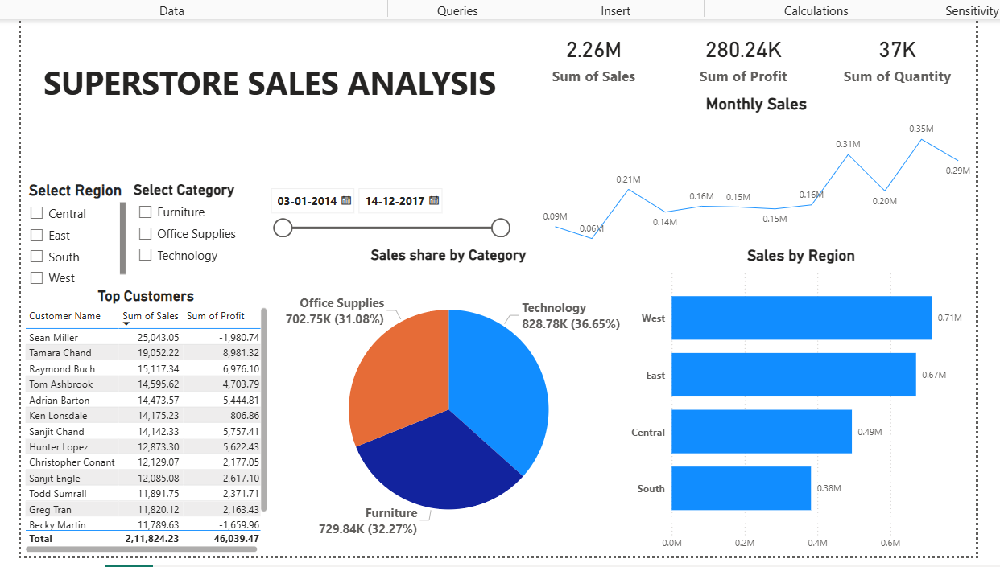

# Superstore Sales Data Analysis 📊

## 📝 Project Overview
This repository contains the completion of **Task 1** for the Data Analytics & Business Intelligence Internship at Maincrafts Technology. The objective of this project is to analyze the Superstore Sales dataset to understand sales performance, profitability, regional variations, and the impact of discounts, ultimately providing actionable recommendations for business growth.

## 🛠️ Tools & Technologies Used
* **Microsoft Excel:** Data Cleaning, Data Dictionary creation, and Advanced Pivot Tables.
* **SQL:** Data Extraction, Aggregation, and answering critical business queries.
* **Power BI :** Interactive Dashboard creation and Data Visualization.

## 🚀 Project Workflow
1. **Data Cleaning (Excel):** Handled missing values, standardized formats, and ensured data integrity.
2. **Data Extraction (SQL):** Wrote complex queries to identify top customers, profitable categories, and the impact of discounts on overall profit.
3. **Data Visualization (Power BI):** Designed an interactive dashboard featuring KPI cards, bar charts for regional sales, line charts for monthly trends, and slicers for dynamic filtering.
4. **Business Insights Generation:** Compiled a comprehensive report detailing key findings and strategic recommendations for the management.

## 📂 Files in this Repository
* `cleaned_sales_data.xlsx`: The cleaned dataset along with the Data Dictionary and Pivot Tables.
* `Task1_SQL_Extraction.sql`: The SQL script containing all queries used for data extraction.
* `Superstore_Sales_Dashboard.pbix`: The interactive Power BI dashboard file.
* `Dashboard_Screenshot.png`: A visual snapshot of the final Power BI dashboard.
* `Business_Insights_Report.pdf`: A detailed report highlighting key findings and recommendations.

## 💡 Key Business Insights & Recommendations
* **Overall Performance:** The business is profitable, generating approximately 2.26M in sales and 280K in profit with 37K units sold.
* **Regional Performance:** The West and East regions drive the highest sales. Recommendation: Focus on expanding marketing and distribution in the lower-performing Central and South regions.
* **Category Performance:** Technology is the most profitable and highest-selling category. Furniture generates significant sales but suffers from lower profit margins. 
* **Customer Retention:** A small number of top customers contribute to a large portion of total sales. Recommendation: Implement loyalty programs and personalized offers to retain these high-value clients.
* **Discount Impact:** Excessive discounts heavily reduce overall profitability and sometimes lead to losses. Recommendation: Implement a controlled discount strategy, especially on low-margin products.
* **Seasonal Trends:** Sales peak towards the end of the year, specifically in November and December. Recommendation: Prepare inventory and promotional campaigns ahead of Q4 to maximize revenue.
---
*Developed by [Hrushikesh Santosh Khedkar] during the Maincrafts Technology Internship.*
